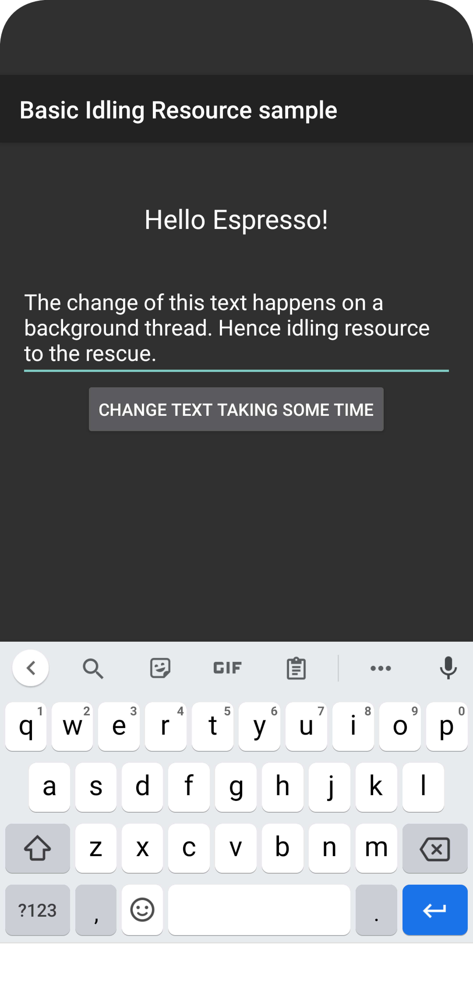
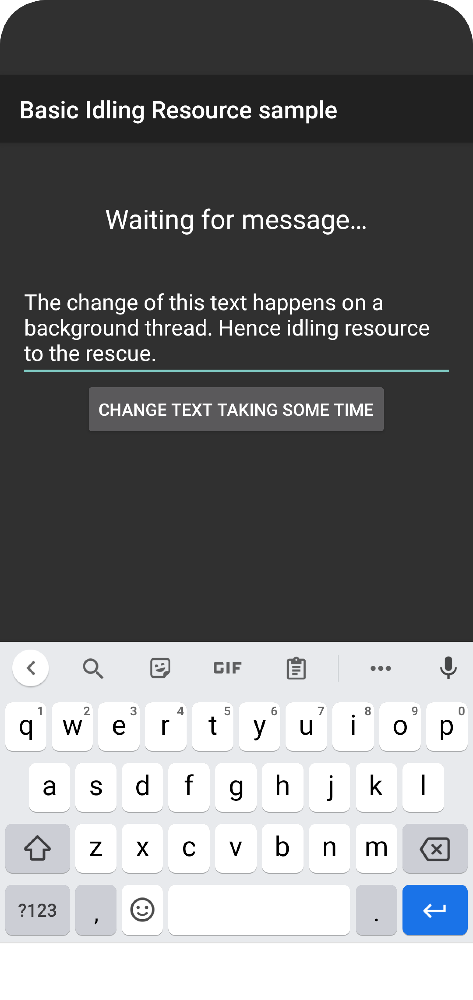
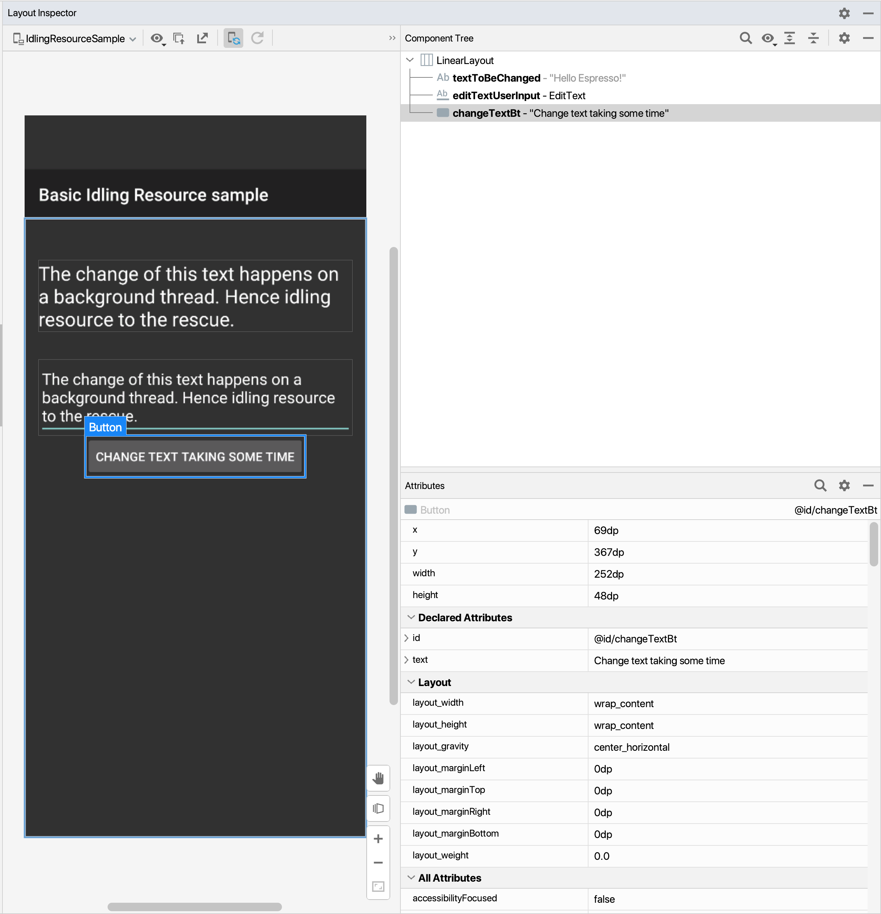

<figure class="image">
    
    <figcaption>
        Espresso logo image by <a
            href="https://www.google.com/imgres?imgurl=https%3A%2F%2Fmiro.medium.com%2Fmax%2F600%2F1*Z2iFvuo4pMsK-aYhPkiGWA.png&imgrefurl=https%3A%2F%2Fproandroiddev.com%2Ftesting-android-ui-with-pleasure-e7d795308821&tbnid=2m9PR31uA1zqGM&vet=12ahUKEwjtm9SLnMT3AhVE8IUKHREuDVUQMygAegUIARCpAQ..i&docid=cWI2R5HvetOtGM&w=600&h=692&q=espresso%20android&ved=2ahUKEwjtm9SLnMT3AhVE8IUKHREuDVUQMygAegUIARCpAQ">Pro Android Dev</a> 
    </figcaption>
</figure>

In the last part [Hello, espresso! Part 3 Working with
intents](),
we understood how to use espresso intents for both validation and stubbing. Go
ahead and have a read in case you missed it.

## Dealing with synchronization issues in espresso

Espresso is a smart framework that automatically takes care of some common
synchronization use cases for us thus requiring test authors to put minimal
synchronization code in place.

When we invoke `onView()`, espresso waits and checks for the below conditions
before proceeding with assertions

- Is the message queue empty?
- Are there any instances of `AsyncTask` executing any tasks?
- Are all developer defined Idling resources idle?

While this is great for most of the use cases

Espresso still isn't aware of any other async (asynchronous) operations such as
**some operation running on a background thread**

In such cases, we need to let espresso handle know about these, by registering
them as an **Idling resource**

## Avoid using bad workarounds for synchronization 👎🏼🚫

When trying to synchronize your tests with the app behavior, It's possible that
you may look for a **quick workaround** (some of these are listed below),

However, I would encourage you to not use these as that would lead to much more
maintainable and reliable tests:

- **Use `Thread.sleep()`** to put an artificial delay in your test is a really
  bad idea since you don't in advance how much time an operation would take when
  it's run on slower devices. This scales very poorly when the time taken by
  async operation changes in the future and is one of the most common reasons
  for **"flaky"** tests 😳
- **Implement retry wrappers** You may think, I'll just keep a loop running that
  checks if the app is still performing async work until a timeout happens, many
  popular E2E frameworks like `Appium`, `Selenium` do use this approach. Again,
  it's not very deterministic and can vary with device and network conditions
- **Using instances of
  [CountDownLatch](https://developer.android.com/reference/java/util/concurrent/CountDownLatch)**
  to wait until some no of operations executing on another thread is complete.
  These objects have a timeout and add unnecessary complexity to your code
  increasing maintenance overhead

> Read
> [Android developers guide](https://developer.android.com/training/testing/espresso/idling-resource#identify-when-needed)
> for some more context on this

## When to use Idling resources

What are some of the common use cases when we could consider using Idling
resources?

Glad you asked. Below are a few of them:

- Load data from the internet
- Load data from the local data source
- Establish connection with DB and callbacks
- Manage services, either system or `IntentService`
- Perform complex business logic like bitmap transformations

If these operations update a UI that we want to validate, then we should
register them as Idling resource

## Let's write a test 🧑🏻‍💻

By now, it's clear that by using `IdlingResource`, we essentially make our test
wait until whatever operations an app is performing are completed, let's see a
practical example to wrap our heads around this:

### Setting up dependencies

For this test, we'll be using a simple idling resource implementation (more on
how exactly a bit later in the blog) and we need to add below to our
`app/build.gradle` file

```groovy
// Note that espresso-idling-resource is used in the code under test.
implementation 'androidx.test.espresso:espresso-idling-resource:' + rootProject.espressoVersion
```

Gradle tip: You can see the `rootProject.espressoVersion` in the root
`build.gradle` under `ext` block

```groovy
ext {
    buildToolsVersion = "31.0.0"
    androidxAnnotationVersion = "1.2.0"
    guavaVersion = "30.1.1-android"
    coreVersion = "1.4.1-alpha05"
    extJUnitVersion = "1.1.4-alpha05"
    runnerVersion = "1.5.0-alpha02"
    espressoVersion = "3.5.0-alpha05"
}
```

### The App under test 🧐

We are using a sample app similar to our first example with some modifications
to demo Idling resource, You can find the app at
[IdlingResourceSample](https://github.com/automationhacks/testing-samples/tree/main/ui/espresso/IdlingResourceSample)
and the
[test case](https://github.com/automationhacks/testing-samples/blob/main/ui/espresso/IdlingResourceSample/app/src/androidTest/java/com/example/android/testing/espresso/IdlingResourceSample/ChangeTextIdlingResourcePracticeTest.java)
on Github

Assume that we need to automate the below scenario:

```text
GIVEN the user types "some text" in EditText with id: editTextUserInput
AND the user taps on the "Change text taking some time" Button (with id: changeTextBt)
THEN app displays entered text in TextView with id: textToBeChanged
```

Below is how the app looks for each of these steps:

- GIVEN the user types "some text" in `EditText` with `id: editTextUserInput`



- AND the user taps on the "Change text taking some time" Button (with id: changeTextBt)
  - Notice: The app displays a temporary text `"Waiting for message...` as it
    waits for the background operation to complete



THEN app displays entered text in TextView with id: textToBeChanged


And this is how the layout inspector looks for this app



### The test that waits 🛑

Below is the complete test for this:

`ChangeTextIdlingResourcePracticeTest.java`

```java
package com.example.android.testing.espresso.IdlingResourceSample;

import static androidx.test.espresso.Espresso.onView;
import static androidx.test.espresso.action.ViewActions.click;
import static androidx.test.espresso.action.ViewActions.closeSoftKeyboard;
import static androidx.test.espresso.action.ViewActions.typeText;
import static androidx.test.espresso.assertion.ViewAssertions.matches;
import static androidx.test.espresso.matcher.ViewMatchers.withId;
import static androidx.test.espresso.matcher.ViewMatchers.withText;

import android.app.Activity;

import androidx.test.core.app.ActivityScenario;
import androidx.test.espresso.IdlingRegistry;
import androidx.test.espresso.IdlingResource;
import androidx.test.ext.junit.rules.ActivityScenarioRule;
import androidx.test.ext.junit.runners.AndroidJUnit4;

import org.junit.After;
import org.junit.Before;
import org.junit.Rule;
import org.junit.Test;
import org.junit.runner.RunWith;

@RunWith(AndroidJUnit4.class)
public class ChangeTextIdlingResourcePracticeTest {
    // We create a variable to hold an idling resource instance
    private IdlingResource mIdlingResource;

    /**
     * Before a test executes, we get idling resource from activity and register it into
     * the IdlingRegistry
     */
    @Before
    public void registerIdlingResource() {
        // We use ActivityScenario to launch and get access to our MainActivity
        ActivityScenario activityScenario = ActivityScenario.launch(MainActivity.class);

        // activityScenario.onActivity provides a thread safe mechanism to access the activity
        // We pass the activity as a lambda and then register it into idling registry
        activityScenario.onActivity((ActivityScenario.ActivityAction<MainActivity>) activity -> {
            mIdlingResource = activity.getIdlingResource();
            IdlingRegistry.getInstance().register(mIdlingResource);
        });
    }

    @Test
    public void whenUserEntersTextAndTapsOnChangeText_ThenTextChangesWithADelay() {
        // Type text in text box with type something ...
        String text = "This is gonna take some time";
        onView(withId(R.id.editTextUserInput)).perform(typeText(text), closeSoftKeyboard());

        // Tap on "Change text taking some time" button
        onView(withId(R.id.changeTextBt)).perform(click());

        // Assert the entered text is displayed on the screen
        onView(withId(R.id.textToBeChanged)).check(matches(withText(text)));

        /* NOTE: We'll get below error if we try to run this test without idling resources
         * androidx.test.espresso.base.AssertionErrorHandler$AssertionFailedWithCauseError: 'an instance of android.widget.TextView and view.getText()
         * with or without transformation to match: is "This is gonna take some time"' doesn't match the selected view.
           Expected: an instance of android.widget.TextView and view.getText() with or without transformation to match: is "This is gonna take some time"
           Got: view.getText() was "Waiting for message…"
         */
    }

    @After
    public void unregisterIdlingResource() {
        /**
         * After the test has finished, we unregister this idling resource
         * from the IdlingRegistry
         */
        if (mIdlingResource != null) {
            IdlingRegistry.getInstance().unregister(mIdlingResource);
        }
    }
}
```

Let's unpack this line by line ✌🏼

If you notice the test
`whenUserEntersTextAndTapsOnChangeText_ThenTextChangesWithADelay`, you'll see it
is very similar to the first test that we wrote. (If you need to refresh your
memory you could read the first part
[here]())

however, ✋🏼 if we just write that test and run using Android studio, we'll see
espresso throw an error like below:

```java
androidx.test.espresso.base.AssertionErrorHandler$AssertionFailedWithCauseError: 'an instance of android.widget.TextView and view.getText()
  * with or without transformation to match: is "This is gonna take some time"' doesn't match the selected view.
    Expected: an instance of android.widget.TextView and view.getText() with or without transformation to match: is "This is gonna take some time"
    Got: view.getText() was "Waiting for message…"
```

What happened?

This test fails because the app has a delay between the text being updated on
the UI (due to some background thread operation that espresso is not aware of,
and while we expect our entered text to show up in the `TextView`, we instead
see `Waiting for message…`

### Idling resource to the rescue 🏃‍♂️

We'll need to **somehow** tell espresso that we want to wait until this
background process completes. Let's dive into how that's done.

#### Create a variable to hold instance

We first create a variable to hold an `idlingResource` instance

```java
private IdlingResource mIdlingResource;
```

#### Register idling resource into idling registry

We then need to register our resource into
[`IdlingRegistry`](https://developer.android.com/reference/androidx/test/espresso/IdlingRegistry),

What the heck is a registry? 🤷🏼‍♂️

As per
[official docs](https://developer.android.com/reference/androidx/test/espresso/IdlingRegistry):

> - Handles registering and unregistering of IdlingResources with Espresso from
>   within your application code.
> - These resources are required by Espresso to provide synchronization against
>   your application code. All registered resources with this registry will be
>   automatically synchronized against for each Espresso interaction.
> - This registry along with IdlingResource interface are bundled together in a
>   small light weight module so that it can be pulled in as a dependency of the
>   App under test with close to no overhead.

Let's see how:

Next, we setup our idling resource to be setup **before** each test run, to do
that we need a handle to the activity and use `ActivityScenario` to launch our
activity

```java
ActivityScenario activityScenario = ActivityScenario.launch(MainActivity.class);
```

We then perform below steps to register our resource

- We then get the `idlingResource` from the activity by writing a lambda
- Get an instance of `IdlingRegistry`
- and then register our idlingResource into the `IdlingRegistry`

```java
(ActivityScenario.ActivityAction<MainActivity>) activity -> {
            mIdlingResource = activity.getIdlingResource();
            IdlingRegistry.getInstance().register(mIdlingResource);
        }
```

We call the above lambda on the `onActivity()` method

```java
activityScenario.onActivity()
```

Below is what the complete setup method looks like:

```java
/**
* Before a test executes, we get idling resource from activity and register it into
* the IdlingRegistry
*/
@Before
public void registerIdlingResource() {
  // We use ActivityScenario to launch and get access to our MainActivity
  ActivityScenario activityScenario = ActivityScenario.launch(MainActivity.class);

  // activityScenario.onActivity provides a thread safe mechanism to access the activity
  // We pass the activity as a lambda and then register it into idling registry
  activityScenario.onActivity((ActivityScenario.ActivityAction<MainActivity>) activity -> {
      mIdlingResource = activity.getIdlingResource();
      IdlingRegistry.getInstance().register(mIdlingResource);
  });
}
```

But wait, where did we implement the `activity.getIdlingResource()` 🤔?

I'm glad you spotted it as well, It's a method that we need to add to our
Activity, Let's look at
`com/example/android/testing/espresso/IdlingResourceSample/MainActivity.java`

> **Please note:** In most cases, if an implementation of idling resource has
> already been created, then you could just use it out of the box, but
> understanding the internals are helpful to provide us insights into how an
> example implementation looks like and to understand the code flow and if we
> want to implement our own.

```java
/**
* Only called from test, creates and returns a new {@link SimpleIdlingResource}.
*/
@VisibleForTesting
@NonNull
public IdlingResource getIdlingResource() {
  if (mIdlingResource == null) {
      mIdlingResource = new SimpleIdlingResource();
  }
  return mIdlingResource;
}
```

In this implementation, we create an Instance of `SimpleIdlingResource` and set
it into the `mIdlingResource` instance set in the activity

`SimpleIdlingResource.java`

You can see the complete implementation at:
`com/example/android/testing/espresso/IdlingResourceSample/IdlingResource/SimpleIdlingResource.java`
as well

```java
public class SimpleIdlingResource implements IdlingResource {

    @Nullable private volatile ResourceCallback mCallback;

    // Idleness is controlled with this boolean.
    private AtomicBoolean mIsIdleNow = new AtomicBoolean(true);

    @Override
    public String getName() {
        return this.getClass().getName();
    }

    @Override
    public boolean isIdleNow() {
        return mIsIdleNow.get();
    }

    @Override
    public void registerIdleTransitionCallback(ResourceCallback callback) {
        mCallback = callback;
    }

    /**
     * Sets the new idle state, if isIdleNow is true, it pings the {@link ResourceCallback}.
     * @param isIdleNow false if there are pending operations, true if idle.
     */
    public void setIdleState(boolean isIdleNow) {
        mIsIdleNow.set(isIdleNow);
        if (isIdleNow && mCallback != null) {
            mCallback.onTransitionToIdle();
        }
    }
}
```

- We use a flag `mIsIdleNow` to denote if the app is idle
- Also, We set a method `setIdleState` to set this state and call
  `onTransitionToIdle` on the `ResourceCallback`

If we peek the code for
[`IdlingResource` interface](https://developer.android.com/reference/androidx/test/espresso/IdlingResource),
we can see that a method providing implementation of `onTransitionToIdle()` is
called to tell espresso that the app is in a idle state

```java
/** Registered by an {@link IdlingResource} to notify Espresso of a transition to idle. */
public interface ResourceCallback {
  /** Called when the resource goes from busy to idle. */
  public void onTransitionToIdle();
}
```

### Unregister idling resource from the registry

Once our test has finished execution, we want to also unregister this idling
resource from the IdlingRegistry using `unregister()` method

```java
@After
public void unregisterIdlingResource() {
  /**
    * After the test has finished, we unregister this idling resource
    * from the IdlingRegistry
    */
  if (mIdlingResource != null) {
      IdlingRegistry.getInstance().unregister(mIdlingResource);
  }
}
```

If we run our test, it should pass

## Bonus: How does the app implement the delay?

If you are curious on how the app is implementing the delay, please read this
section

There is a class `MessageDelayer`, that declares a `processMessage` method that
takes a string message, instance of the callback and an idlingResource

`MessageDelayer.java`

```java
package com.example.android.testing.espresso.IdlingResourceSample;

import android.os.Handler;
import androidx.annotation.Nullable;
import androidx.test.espresso.IdlingResource;

import com.example.android.testing.espresso.IdlingResourceSample.IdlingResource.SimpleIdlingResource;

/**
 * Takes a String and returns it after a while via a callback.
 * <p>
 * This executes a long-running operation on a different thread that results in problems with
 * Espresso if an {@link IdlingResource} is not implemented and registered.
 */
class MessageDelayer {

    private static final int DELAY_MILLIS = 3000;

    interface DelayerCallback {
        void onDone(String text);
    }

    /**
     * Takes a String and returns it after {@link #DELAY_MILLIS} via a {@link DelayerCallback}.
     * @param message the String that will be returned via the callback
     * @param callback used to notify the caller asynchronously
     */
    static void processMessage(final String message, final DelayerCallback callback,
            @Nullable final SimpleIdlingResource idlingResource) {
        // The IdlingResource is null in production.
        if (idlingResource != null) {
            idlingResource.setIdleState(false);
        }

        // Delay the execution, return message via callback.
        Handler handler = new Handler();
        handler.postDelayed(new Runnable() {
            @Override
            public void run() {
                if (callback != null) {
                    callback.onDone(message);
                    if (idlingResource != null) {
                        idlingResource.setIdleState(true);
                    }
                }
            }
        }, DELAY_MILLIS);
    }
}
```

Few things to note:

- If we have a valid instance of `idlingResource`, We set idle to false

```java
idlingResource.setIdleState(false);
```

- We use `Handler` to post our messages with a delay using `DELAY_MILLIS` and
  set the state to idle once we are done

We call this delayer from the `onClick()` method of the `MainActivity`

`MainActivity.java`

```java
@Override
public void onClick(View view) {
  // Get the text from the EditText view.
  final String text = mEditText.getText().toString();

  if (view.getId() == R.id.changeTextBt) {
      // Set a temporary text.
      mTextView.setText(R.string.waiting_msg);
      // Submit the message to the delayer.
      MessageDelayer.processMessage(text, this, mIdlingResource);
  }
}
```

## Next steps 🫵🏼

- This post talks about the basic concepts around idling resources, in your app
  you may want to use other implementation like:
  - `CountingIdlingResource`,
  - `UriIdlingResource`,
  - `IdlingThreadPoolExecutor`,
  - `IdlingScheduledThreadPoolExecutor` etc.
  - Discussing them in detail is beyond the scope of this post, however feel
    free to refer to these in the
    [official guide](https://developer.android.com/training/testing/espresso/idling-resource#example-implementations)
    and then understand/implement them for your specific use case, We might go
    in detail on few of them in a future post
- If you choose to implement your own idling resource, Please read
  [these](https://developer.android.com/training/testing/espresso/idling-resource#create-own)
  to know about some good patterns

## Resources 📘

- You can find the app and test code for this post on Github:
  - [App](https://github.com/automationhacks/testing-samples/tree/main/ui/espresso/IdlingResourceSample)
  - [Test code](https://github.com/automationhacks/testing-samples/blob/main/ui/espresso/IdlingResourceSample/app/src/androidTest/java/com/example/android/testing/espresso/IdlingResourceSample/ChangeTextIdlingResourcePracticeTest.java)
- Please read
  [espresso idling resource](https://developer.android.com/training/testing/espresso/idling-resource)
  that talks about how to work with idling resources on Android developers

## Conclusion ✅

Hopefully, this post gives you an idea of how to work with Idling resources in
espresso. Stay tuned for the next post where we’ll dive into how to automate and
work with **WebViews** with espresso

As always, Do share this with your friends or colleagues and if you have
thoughts or feedback, I’d be more than happy to chat over on Twitter or
comments. Until next time. Happy Testing and learning.
