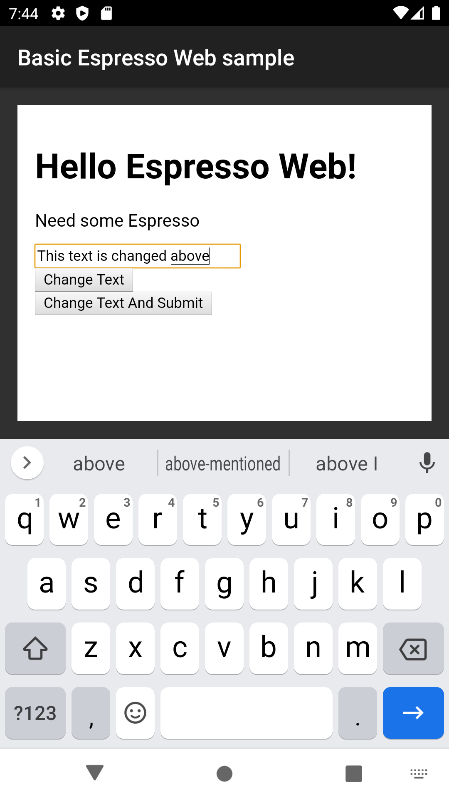
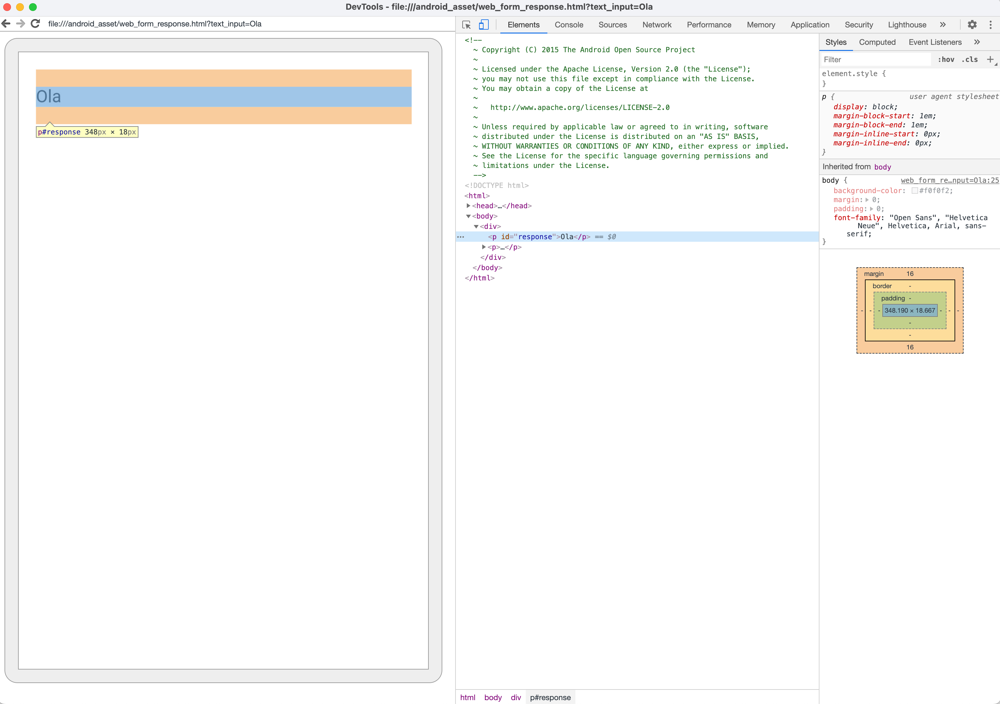

<figure class="image">
    
    <figcaption>
        Espresso logo image by <a
            href="https://www.google.com/imgres?imgurl=https%3A%2F%2Fmiro.medium.com%2Fmax%2F600%2F1*Z2iFvuo4pMsK-aYhPkiGWA.png&imgrefurl=https%3A%2F%2Fproandroiddev.com%2Ftesting-android-ui-with-pleasure-e7d795308821&tbnid=2m9PR31uA1zqGM&vet=12ahUKEwjtm9SLnMT3AhVE8IUKHREuDVUQMygAegUIARCpAQ..i&docid=cWI2R5HvetOtGM&w=600&h=692&q=espresso%20android&ved=2ahUKEwjtm9SLnMT3AhVE8IUKHREuDVUQMygAegUIARCpAQ">Pro Android Dev</a> 
    </figcaption>
</figure>

In the last part [Hello, espresso! Part 4 Working with Idling resources
😴](), We
understood how to use **espresso idling resources** to achieve synchronization
when the app is running background tasks that espresso is not aware of. Go ahead
and have a read in case you missed it.

## Automating Hybrid apps with WebViews

Switching gears to a different topic now, many android apps expose certain
business logic in WebViews (a.k.a a mobile browser) within Native apps

Its quite important to cover the interaction your native app has with these Web
components to ensure there are no missed regressions

Some common examples when an app might have a WebView are:

- A help or support page for your business that needs to be dynamic and change
  whenever a new page/option is added
- Or pages to host marketing content is launched
- Or even lengthy terms and conditions for a new feature

Having a WebView is great since its much faster to make changes and roll out web
app changes to production

## What to cover and what not? 🤔

Espresso framework provides a library `espresso-web` which provides an "espresso
like" interface over **Selenium WebDriver** API

When should you write an espresso web test? ✅

If your app has user journeys between native app and webview, and you want to
make sure these **interactions** work then it surely makes sense to cover this
as part of an Espresso test

When you should not? ❌

However, if you only want to **verify the `WebView` content or functionality**
without any native interaction chceks, then its much better to write an
**automated Web Test** instead using Selenium WebDriver or equivalent library as
that would be much faster and easier to write, maintain and run

## How does this work?

Espresso web uses a Javascript bridge to interact with the WebDriver framework
and uses **atoms** which are considered equivalent to `ViewMatcher` and
`ViewAction`, espresso web wraps these atoms with `Web` and `Web.WebInteraction`
classes that makes writing an Espresso web test feel similar to writing a test
for a native app

As a general flow, we might use `findElement()` or `getElement()` methods with
certain locators to find an element and then perform an action or assertion on
top

## Writing your first Web test

Let's write a test to see this in action

### Adding dependencies

We need to add `espresso-web` to our `app/build.gradle` file

```java
androidTestImplementation 'androidx.test:core:' + rootProject.coreVersion;
androidTestImplementation 'androidx.test.ext:junit:' + rootProject.extJUnitVersion;
androidTestImplementation 'androidx.test:runner:' + rootProject.runnerVersion;
androidTestImplementation 'androidx.test:rules:' + rootProject.rulesVersion;
androidTestImplementation 'androidx.test.espresso:espresso-web:' + rootProject.espressoVersion;
```

And add below library versions in root `build.gradle` file

```java
ext {
    buildToolsVersion = "31.0.0"
    androidxAnnotationVersion = "1.2.0"
    guavaVersion = "30.1.1-android"
    coreVersion = "1.4.1-alpha05"
    extJUnitVersion = "1.1.4-alpha05"
    runnerVersion = "1.5.0-alpha02"
    rulesVersion = "1.4.1-alpha05"
    espressoVersion = "3.5.0-alpha05"
}
```

### Understanding app under test

Let's understand the app flows that we would be automating before we jump into
code

```text
Feature: Test WebView inside Native app using espresso
Scenario: When user enters text and taps on Change text
  GIVEN the user is on the home page of BasicEspressoWebSample
  WHEN the user enters a text in textbox
  AND the user taps on "Change Text" button
  THEN the label displays the entered test

Scenario: When user enters text and taps on Change text
  GIVEN the user is on the home page of BasicEspressoWebSample
  WHEN the user enters a text in textbox
  AND the user taps on "Change Text And Submit" button
  THEN the web page redirects to another page with a label displaying the entered test
```



Figure: WHEN the user enters a text in textbox


Figure: AND the user taps on "Change Text" button THEN the label displays the
entered test


Figure: THEN the web page redirects to another page with a label displaying the
entered test

### Finding locators

If you try to use the "Layout Inspector", then you'll be dissapointed to see
that it does not show the DOM (Document object model) tree to allow us to find
the desired locator, it only shows the containing WebView


Figure: Trying to use layout inspector

We thus need to use
[Chrome remote debugging tool](https://developer.chrome.com/docs/devtools/remote-debugging/)
to inspect our app. You can follow the detailed steps in this blog to understand
this fully.

However in short, you need to connect your device or emulator, ensure developer
options are enabled, and verify that USB debugging is enabled and the connected
laptop trusts your android device

Once done, you can type `chrome://inspect` in your chrome browser tab and this
would open chrome debugging tools like below, and then tap on **Inspect**


Figure: Chrome inspect devices screen

Once you tap on inspect it should bring up Chrome developer tools window and you
can go to **Elements** tab and then use the inspect button to look at the
HTML/CSS structure of the web page


Figure: Chrome dev tools showing the webview and its associated DOM for home
page

Once you enter some text and tap on "Change text and submit" button, you'll see
a screen like below



Figure: Chrome dev tools showing the 2nd web page after user taps on "Change
text and Submit"

### Enabling Chrome debugging + JavaScript (JS) Execution on the app

We need to add few lines in our apps source code to enable chrome debugging

Please ensure you add line:
`WebView.setWebContentsDebuggingEnabled(BuildConfig.DEBUG);`

This method was also added in Android Kit kat thus we add annotation like
`@RequiresApi(api = Build.VERSION_CODES.KITKAT)` to our `onCreate` method as
well

We also add additional logic to enable JS execution

```java
mWebView.getSettings().setJavaScriptEnabled(true);
mWebView.loadUrl(urlFromIntent(getIntent()));
mWebView.requestFocus();
mWebView.setWebViewClient(new WebViewClient() {
    @Override
    public boolean shouldOverrideUrlLoading(WebView view, String url) {
        return false;
    }
});
```

The complete method looks like below:

```java
// setWebContentsDebuggingEnabled requires KITKAT version+, thus adding @RequiresApi annotation
    // Also suppressing warning about enabling Javascript execution that can cause XSS vulnerabilities
    @SuppressLint("SetJavaScriptEnabled")
    @RequiresApi(api = Build.VERSION_CODES.KITKAT)
    @Override
    protected void onCreate(Bundle savedInstanceState) {
        super.onCreate(savedInstanceState);
        setContentView(R.layout.activity_web_view);
        mWebView = (WebView) findViewById(R.id.web_view);

        // Enables chrome remote debugging:
        // https://stackoverflow.com/questions/21903934/how-to-debug-webview-remotely
        WebView.setWebContentsDebuggingEnabled(BuildConfig.DEBUG);

        mWebView.getSettings().setJavaScriptEnabled(true);
        mWebView.loadUrl(urlFromIntent(getIntent()));
        mWebView.requestFocus();
        mWebView.setWebViewClient(new WebViewClient() {
            @Override
            public boolean shouldOverrideUrlLoading(WebView view, String url) {
                return false;
            }
        });
    }

    private static String urlFromIntent(@NonNull Intent intent) {
        checkNotNull(intent, "Intent cannot be null!");
        String url = intent.getStringExtra(KEY_URL_TO_LOAD);
        return !TextUtils.isEmpty(url) ? url : WEB_FORM_URL;
    }
```

If you are not familiar with how to find web locators, search for "locators
xpath" or "locators css" and you should be able to find tons of resources

## Resources 📘

- You can find the app and test code for this post on Github:
  - [App](https://github.com/automationhacks/testing-samples/tree/main/ui/espresso/WebBasicSample)
  - [Test code](https://github.com/automationhacks/testing-samples/blob/main/ui/espresso/WebBasicSample/app/src/androidTest/java/com/example/android/testing/espresso/web/BasicSample/WebViewPracticeTest.java)
- Please read
  [Espresso Web](https://developer.android.com/training/testing/espresso/web) on
  android developers for some more context

## Conclusion ✅

Hopefully, this post gives you an idea of how to work with Idling resources in
espresso. Stay tuned for the next post where we’ll dive into how to automate and
work with **WebViews** with espresso

As always, Do share this with your friends or colleagues and if you have
thoughts or feedback, I’d be more than happy to chat over on Twitter or
comments. Until next time. Happy Testing and learning.
