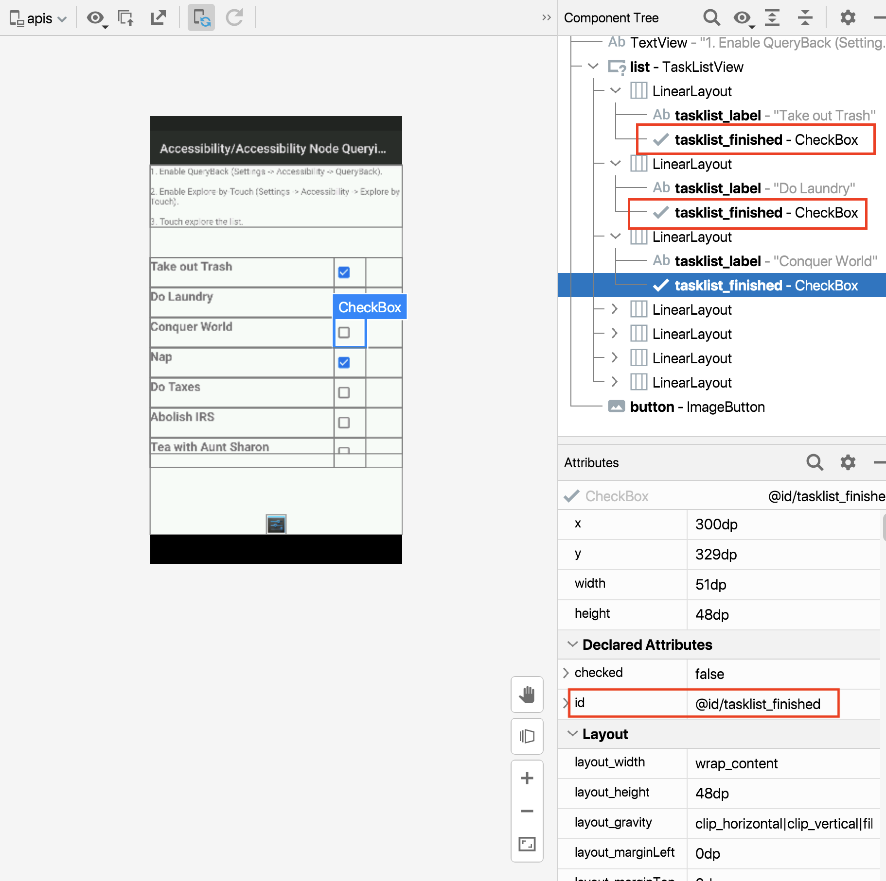

<figure class="image">
    
    <figcaption>
        Espresso logo image by <a
            href="https://www.google.com/imgres?imgurl=https%3A%2F%2Fmiro.medium.com%2Fmax%2F600%2F1*Z2iFvuo4pMsK-aYhPkiGWA.png&imgrefurl=https%3A%2F%2Fproandroiddev.com%2Ftesting-android-ui-with-pleasure-e7d795308821&tbnid=2m9PR31uA1zqGM&vet=12ahUKEwjtm9SLnMT3AhVE8IUKHREuDVUQMygAegUIARCpAQ..i&docid=cWI2R5HvetOtGM&w=600&h=692&q=espresso%20android&ved=2ahUKEwjtm9SLnMT3AhVE8IUKHREuDVUQMygAegUIARCpAQ">Pro Android Dev</a> 
    </figcaption>
</figure>

In the last part [Hello, espresso! Part 5 Automating WebViews
🕸️🌎](),
We understood how to automate web views with espresso. Go ahead and have a read
in case you missed it.

By now, You should have a fair idea on how to automate android UI tests with
espresso and have a solid idea on its API, in the next few posts we'll look at
how to accomplish a specific task to automate common scenarios in android apps

Let's go.

## How to find an element with its sibling

Mobile apps often have reusable components wherein the same component is duplicated in a list like control. In such cases there will be multiple elements with similar `ID` and finding them using `R.id.x` would not work.

In such cases, we can find elements using some unique property of its adjacent (or sibling) element.

Let's take a look at an example to understand how this works in action

## Understanding the App under test

For this test we'll use [`APIDemos` app](https://github.com/automationhacks/android-apidemos) which has been forked from the popular Appium project (which itself was forked from a Google repo). This app showcases lot of Android components as examples and as such is quite a decent playground app for us to automate using espresso.

Say we want to automate below scenario:

```gherkin
GIVEN user opens Task list activity
WHEN user taps on checkbox with id `@id/tasklist_finished` for "Conquer world" item in checklist
THEN checkbox is enabled
```


If you are manually exploring the app using Android emulator within android studio you can arrive at this screen by tapping on **Accessibility > Accessibility Node Querying**

You may try to find a unique id for this checkbox, you'll find there are multiple such checkboxes within `@android:id/list` and we can't use that attribute, however each checkbox has a TextView control that has a unique text and we can use this property to identify the element



## Let's write our test

We launch our activity using:

```java
@Rule
    public ActivityScenarioRule<TaskListActivity> activityScenarioRule =
            new ActivityScenarioRule<>(TaskListActivity.class);
```

Let's use the property that the sibling element has a unique text to find the desired element

```java
String taskText = "Conquer World";
onView(allOf(withId(R.id.tasklist_finished), hasSibling(withText(taskText))))
```

We start by saying:

- We want to find a view that matches all the the properties by wrapping the conditions in `allOf`
- Next we say we want to find an element with id `withId(R.id.tasklist_finished)` (i.e. our checkbox)
- However, we only want the element that has a sibling with specific text by specifying `hasSibling(withText(taskText))` that uses `hasSibling` View matcher

Finally once we have found the element, we want to click on it and check that the state changes to checked by specifying:

```java
.perform(click())
.check(matches(isChecked()));
```

Below is the complete test:


```java
package recipes;

import static androidx.test.espresso.Espresso.onView;
import static androidx.test.espresso.action.ViewActions.click;
import static androidx.test.espresso.assertion.ViewAssertions.matches;
import static androidx.test.espresso.matcher.ViewMatchers.hasSibling;
import static androidx.test.espresso.matcher.ViewMatchers.isChecked;
import static androidx.test.espresso.matcher.ViewMatchers.withId;
import static androidx.test.espresso.matcher.ViewMatchers.withText;
import static org.hamcrest.Matchers.allOf;


import androidx.test.ext.junit.rules.ActivityScenarioRule;
import androidx.test.runner.AndroidJUnit4;

import org.junit.Rule;
import org.junit.Test;
import org.junit.runner.RunWith;

import io.appium.android.apis.R;
import io.appium.android.apis.accessibility.TaskListActivity;

@RunWith(AndroidJUnit4.class)
public class FindElementUsingHasSiblingTest {
    @Rule
    public ActivityScenarioRule<TaskListActivity> activityScenarioRule =
            new ActivityScenarioRule<>(TaskListActivity.class);

    @Test
    public void testCanFindElementUsingSiblingMatcher() {
        String taskText = "Conquer World";
        //
        onView(allOf(withId(R.id.tasklist_finished), hasSibling(withText(taskText))))
                .perform(click())
                .check(matches(isChecked()));
    }
}
```


## Resources 📘

- You can find the app and test code for this post on Github under
  `automationhacks/testing-samples`:
  - [App](https://github.com/automationhacks/testing-samples/tree/main/ui/espresso/WebBasicSample)
  - [Test code](https://github.com/automationhacks/testing-samples/blob/main/ui/espresso/WebBasicSample/app/src/androidTest/java/com/example/android/testing/espresso/web/BasicSample/WebViewPracticeTest.java)
- Please read
  [Espresso Web](https://developer.android.com/training/testing/espresso/web) on
  android developers for some more context

## Conclusion ✅

Hopefully, this post gives you an idea of how to work with `WebViews` in
espresso. Stay tuned for the next post where we’ll dive into how to automate and
work with **WebViews** with espresso

As always, Do share this with your friends or colleagues and if you have
thoughts or feedback, I’d be more than happy to chat over on Twitter or
comments. Until next time. Happy Testing and learning.

```

```
